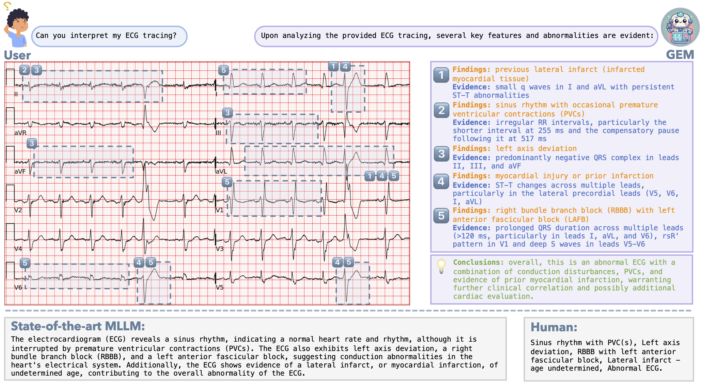

<div align="center">

<h1> GEM: Empowering MLLM for Grounded ECG Understanding with Time Series and Images </h1>

<h5 align="center"> If you find this project useful, please give us a star🌟.

<h5 align="center"> 

<a href='https://www.lanxplanet.com/GEM-ECG/'></a>
<a href='https://arxiv.org/pdf/2503.06073'></a>
<a href='https://huggingface.co/LANSG/GEM'>
<a href='https://huggingface.co/datasets/LANSG/ECG-Grounding'>


[Xiang Lan](https://www.lanxplanet.com/)<sup>1</sup>,
[Feng Wu](https://meiyoufeng116.github.io)<sup>1</sup>,
[Kai He](https://kaihe-better.github.io)<sup>1</sup>,
[Qinghao Zhao]()<sup>2</sup>,
[Shenda Hong](https://hsd1503.github.io/)<sup>3</sup>,
[Mengling Feng](https://www.mornin-feng.com/me)<sup>1</sup>

<sup>1</sup>[National University of Singapore](https://nus.edu.sg/) <sup>2</sup>[Peking University People's Hospital](https://english.pkuph.cn/) <sup>3</sup>[Peking University](https://english.pku.edu.cn/)


<p align="center">
    
</p>

</h5>
</div>

## Introduction

While recent multimodal large language models (MLLMs) have advanced automated ECG interpretation, they still face two key limitations: (1) insufficient multimodal synergy between ECG time series signals and ECG images, and (2) limited explainability in linking diagnoses to granular waveform evidence. We introduce GEM, the first MLLM unifying ECG time series, 12-lead ECG images and text for grounded and clinician-aligned ECG interpretation. GEM enables feature-grounded analysis, evidence-driven reasoning, and a clinician-like diagnostic process through three core innovations: a dual-encoder framework extracting complementary time series and image features, cross-modal alignment for effective multimodal understanding, and knowledge-guided instruction data generation for generating high-granularity grounding data (ECG-Grounding) linking diagnoses to measurable parameters (e.g., QRS/PR Intervals). Additionally, we propose the Grounded ECG Understanding task, a clinically motivated benchmark designed to comprehensively assess the MLLM's capability in grounded ECG understanding. Experimental results on both existing and our proposed benchmarks show GEM significantly improves predictive performance (CSN +7.4%↑), explainability (+22.7%↑), and grounding (+25.3%↑), making it a promising approach for real-world clinical applications.

## 🔥Updates

- **[Sep 2025]** GEM has been accepted to NeurIPS 2025! More updates coming soon.
- **[Jul 2025]** The full version of MIMIC-IV-ECG with beat-level features and GPT-4o interpretations has been released — check it out [here](https://arxiv.org/pdf/2507.15255)!
- **[Mar 2025]** GEM-7B and ECG-Grounding-30k are now available. 

We will continue to release more ECG-Grounding data and associated beat-level features progressively. 

*Stay tuned for updates!*

## Resource

#### Project Page: 📖 [Page](https://www.lanxplanet.com/GEM-ECG/)

#### Paper: 📄 [Arxiv](https://arxiv.org/pdf/2503.06073)

#### Model: 🤗 [GEM](https://huggingface.co/LANSG/GEM)

#### Data: 🤗 [ECG-Grounding](https://huggingface.co/datasets/LANSG/ECG-Grounding)

## Setup

```shell
git clone https://github.com/lanxiang1017/GEM.git
bash GEM/setup.sh
```

## Quickstart (Local)

### Backend (FastAPI)

```bash
pip install -r backend/requirements.txt
uvicorn backend.app.main:app --host 0.0.0.0 --port 8000 --reload
```

### Frontend (Next.js)

```bash
cd frontend
npm install
npm run dev
```

### Environment Variables

Some evaluation scripts require API keys (e.g., OpenAI). Use an untracked `.env` file:

```bash
cp .env.example .env
```

## Unified Pipeline (Recommended)

Training/evaluation orchestration is now standardized via:

```bash
python scripts/gem_pipeline.py <subcommand> --config configs/pipelines/gem_default.yaml
```

Supported subcommands:

- `validate-config`
- `train`
- `finetune`
- `eval-generate-ecgbench`
- `eval-generate-grounding`
- `eval-score-ecgbench`
- `eval-score-report`
- `grounding-merge`
- `grounding-gpt-eval`
- `grounding-score`

You can override any config value with repeated `--set key=value`, and use `--dry-run` to inspect commands.

Legacy LLaVA script migration details: `docs/migrations/llava_scripts_legacy.md`.

### GEM+ Inference API (Phase 1)

The backend now supports a lightweight GEM+ inference flow:

- `GET /samples`: list local indexed samples.
- `POST /predict_plus/by_id`: run inference from indexed sample id.
- `POST /predict_plus/upload`: run inference from uploaded `.npy` (optional `.png` preview sidecar).
- `GET /images/{image_id}`: fetch the standard 3x4 rendered ECG image used by both model input and viewer.

`/predict_plus/*` responses no longer embed `image_base64`; instead they return `viewer.image_id` plus preprocessing/debug metadata:

- `fs_used`
- `preprocess`: `fs_original`, `len_original`, `resampled`, `resample_method`, `cropped`, `padded`
- `validation_warnings`

Key defaults:

- signals are normalized to `fs_used=500`
- resampling uses `scipy.signal.resample_poly` when `fs_original != 500`
- viewer highlighting is computed from `lead + t_start_ms + t_end_ms` on the fixed `standard_3x4` layout

## Project Structure

```
.
├── backend/               # FastAPI service
├── frontend/              # Next.js UI
├── ecg_coca/              # ECG-CoCa encoder + utilities
├── llava/                 # LLaVA-based MLLM code
├── scripts/               # training/eval scripts
├── evaluation/            # benchmarking + reports
├── checkpoints/           # (ignored) model weights
└── data/                  # (ignored) datasets
```

## Data Preparation

Please download required data:

ECG:  
- [MIMIC-IV](https://physionet.org/content/mimic-iv-ecg/1.0/)
- [PTB-XL](https://physionet.org/content/ptb-xl/1.0.3/)
- [Code-15%](https://zenodo.org/records/4916206)
- [CPSC 2018](https://physionet.org/content/challenge-2020/1.0.2/training/cpsc_2018/)
- [CSN](https://physionet.org/content/ecg-arrhythmia/1.0.0/)
- [G12E](https://physionet.org/content/challenge-2020/1.0.2/training/georgia/)

Images:
- [ECG-Grounding-Images](https://huggingface.co/datasets/LANSG/ECG-Grounding) (mimic_gen)
- [PTB-XL-Test-Images](https://huggingface.co/datasets/LANSG/ECG-Grounding) (ptb-xl-gen)
- [ECG-Instruct](https://huggingface.co/datasets/PULSE-ECG/ECGInstruct/tree/main)
- [ECG-Bench](https://huggingface.co/datasets/PULSE-ECG/ECGBench)

After downloading all of them, organize the data as follows in `./data`,

```
├── ecg_timeseries
    └── champan-shaoxing
    └── code15
    └── cpsc2018
    └── ptbxl
    └── georgia
    └── mimic-iv
├── ecg_images
    └── cod15_v4
    └── csn_aug_all_layout_papersize
    └── csn_ori_layout_papersize
    └── csn_part_noise_layout_papersize
    └── gen_images
      └── mimic_gen
      └── ptb-xl-gen
    └── mimic
    └── mimic_v4
    └── ptb-xl
├── ecg_bench
    └── images
    └── ecg-grounding-test-mimiciv.json
    └── ecg-grounding-test-ptbxl.json
├── ecg_jsons
    └── ECG_Grounding_30k.json

```

## Utilities

### Generate ECG images from processed `.npy`

If you have local `processed_data/*/*.npy`, you can generate `.png` ECG images via `gem_generation/ecg-image-generator` and update `data/mixed_train.json` to replace `.npy` image paths with `.png`:

```bash
python scripts/generate_images.py --processed-dir processed_data --json-path data/mixed_train.json
```

Install dependencies as needed (see `gem_generation/ecg-image-generator/requirements.txt`).

## Pretrained Model Preparation

Pretrained ECG Encoder:
  - [ECG-CoCa](https://drive.google.com/drive/folders/1-0lRJy7PAMZ7bflbOszwhy3_ZwfTlGYB?usp=sharing) : download ```cpt_wfep_epoch_20.pt```, place it in ```GEM/ecg_coca/open_clip/checkpoint```

Pretrained MLLMs:
  - [PULSE](https://huggingface.co/PULSE-ECG/PULSE-7B)  
  - [LLaVA](https://huggingface.co/liuhaotian/llava-v1.6-vicuna-7b)

## Train

For training from scratch (recommended):

```bash
python scripts/gem_pipeline.py train --config configs/pipelines/gem_default.yaml
```

Legacy command (still supported during migration window):

```bash
bash scripts/train_gem.sh
```

For fine-tuning on mixed training data (DeepSpeed + LoRA):

```bash
python scripts/gem_pipeline.py finetune --config configs/pipelines/gem_default.yaml \
  --set finetune.model_name_or_path=./checkpoints/GEM-7B \
  --set finetune.data_path=data/mixed_train.json \
  --set finetune.image_folder=. \
  --set finetune.output_dir=./checkpoints/gem-medts-v1
```

Legacy command (still supported during migration window):

```bash
bash scripts/finetune_gem_medts.sh
```

### Training data fields (JSON)

- `image`: path to an ECG image (relative to `--image_folder`, or absolute).
- `time_series` (optional): path to a `.npy` ECG signal (shape `(12, L)` or `(L, 12)`). If provided, it will be used instead of `ecg`.
- `ecg` (optional): wfdb record path (fallback when `time_series` is missing).
- `mask_path` (optional): path to a `.npy` segmentation label array. It will be aligned to length `5000`, and empty positions are filled with `-1` (ignored). Segmentation supervision is currently implemented for LLaMA-based models.

### Training args

- `--modules_to_save`: when using LoRA, additionally keep specified (non-LoRA) modules trainable and save them with the adapter (e.g. `--modules_to_save seg_head`).

## Evaluation

For ECG-Grounding:
  - step 1. generate interpretations:
    - `python scripts/gem_pipeline.py eval-generate-grounding --config configs/pipelines/gem_default.yaml --set evaluation.grounding.question_files_glob='data/ecg_bench/chunks/*.json'`
  - step 2. merge model outputs:
    - `python scripts/gem_pipeline.py grounding-merge --config configs/pipelines/gem_default.yaml`
  - step 3. generate GPT evaluation reports:
    - `python scripts/gem_pipeline.py grounding-gpt-eval --config configs/pipelines/gem_default.yaml`
  - step 4. aggregate grounding scores:
    - `python scripts/gem_pipeline.py grounding-score --config configs/pipelines/gem_default.yaml`

For ECG-Bench:
  - step 1. generate results:
    - `python scripts/gem_pipeline.py eval-generate-ecgbench --config configs/pipelines/gem_default.yaml`
  - step 2. evaluate benchmark results:
    - `python scripts/gem_pipeline.py eval-score-ecgbench --config configs/pipelines/gem_default.yaml`
  - step 3. evaluate reports:
    - `python scripts/gem_pipeline.py eval-score-report --config configs/pipelines/gem_default.yaml`

*Note*
- 1. All path/model overrides can be passed through `--set key=value` in `scripts/gem_pipeline.py`.
- 2. If you download our trained GEM-7B model from HuggingFace, you must set the path to ECG-CoCa in the config.json file (under "mm_ecg_tower") before using it.
- 3. `evaluation/gem_bench/bench_ecgbench.sh` and `evaluation/gem_bench/bench_ecggrounding.sh` are compatibility wrappers to the new pipeline and still accept legacy `-m/-d` style arguments.
 

## Citation

If you find GEM helpful for your research and applications, please cite our paper:

```bibtex
@article{lan2025gem,
  title={Gem: Empowering mllm for grounded ecg understanding with time series and images},
  author={Lan, Xiang and Wu, Feng and He, Kai and Zhao, Qinghao and Hong, Shenda and Feng, Mengling},
  journal={arXiv preprint arXiv:2503.06073},
  year={2025}
}
```

## Acknowledgement
We thank the authors of [PULSE](https://github.com/AIMedLab/PULSE/tree/dev) and [ECG-Chat](https://github.com/YubaoZhao/ECG-Chat) for their publicly released models, datasets, and training codes.
